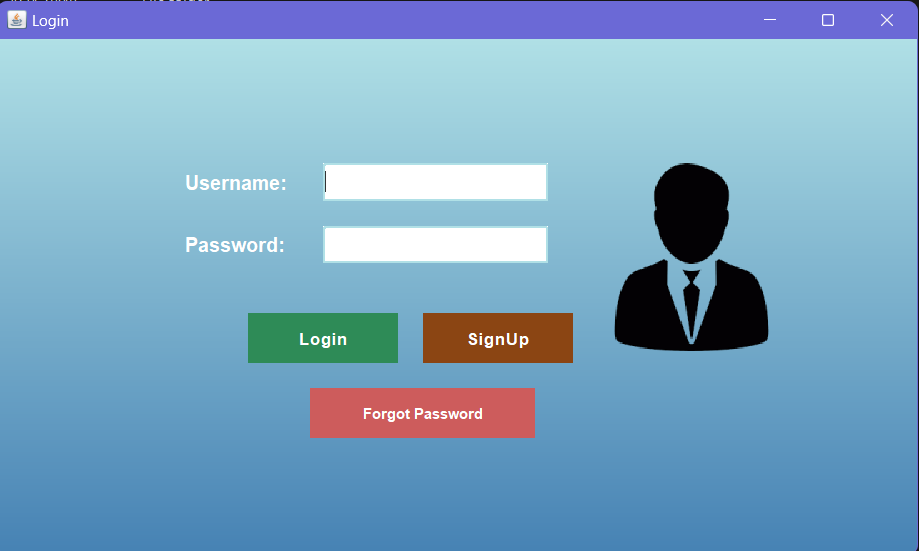
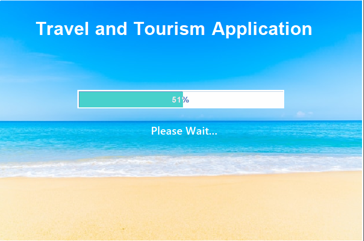
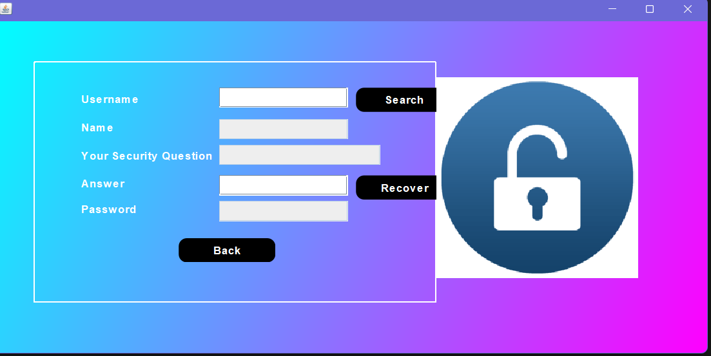
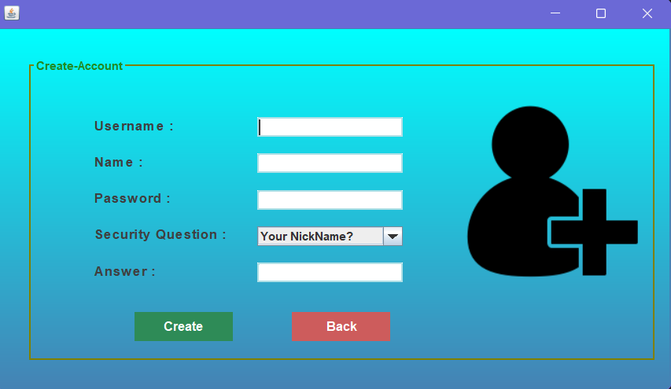

# Travel and Tourism Management System

The **Travel and Tourism Management System** is a Java-based desktop application developed using Java Swing for the user interface and MySQL for backend data management. Designed to simplify and automate bookings and payment processes, this system is ideal for travel and tourism businesses.

## Table of Contents
1. [Overview](#overview)
2. [Features](#features)
   - [User Authentication](#user-authentication)
   - [Hotel Booking System](#hotel-booking-system)
   - [Payment Integration](#payment-integration)
   - [Customer Management](#customer-management)
   - [Hotel Management](#hotel-management)
   - [Booking Management](#booking-management)
   - [Admin Management](#admin-management)
3. [System Requirements](#system-requirements)
4. [Setup Instructions](#setup-instructions)
5. [Screenshots](#screenshots)
6. [License](#license)

## Overview
This system simplifies the end-to-end travel management process, including booking, payment, and customer management. Built with Apache NetBeans IDE, it employs a layered architecture with distinct Presentation, Business Logic, and Data layers for seamless integration and maintenance.

## Features

### User Authentication
- **Login and Signup**: Secure user authentication to ensure privacy and data integrity.
- **Forgot Password**: Allows users to reset credentials if forgotten.

### Hotel Booking System
- **Room Browsing**: Customers can view available hotels and select rooms based on availability, price, and location.
- **Real-time Booking**: Bookings are managed in real-time, ensuring immediate updates on room availability.

### Payment Integration
- **Payment Gateway**: Integrated with a payment gateway (e.g., GooglePay) for secure transactions.
- **Transaction Processing**: Handles payment processing for hotel bookings, ensuring secure and efficient transactions.

### Customer Management
- **Customer Information**: Manage customer details, including contact information and booking history.

### Hotel Management
- **Hotel Database**: Maintain a database of hotels, room types, prices, and availability.
  
### Booking Management
- **Real-time Updates**: View, update, and manage bookings instantly.
- **Room Availability**: Check room availability, handle cancellations, and make booking modifications.

### Admin Management
- **Hotel Management**: Admins can add new hotels, update hotel information, and manage bookings.
- **Reports**: Admins can view booking reports for monitoring and analysis.

## System Requirements
- **Java Development Kit (JDK)**: Version 8 or above
- **Apache NetBeans IDE**: Developed and tested in NetBeans; other IDEs may require additional configuration.
- **MySQL Database**: Set up MySQL and create necessary tables for hotel, booking, and customer data.

## Setup Instructions

1. **Clone the Repository**
   - Clone this repository to your local machine.

2. **Database Configuration**
   - Create a new MySQL database for the system.
   - Define tables for users, hotels, bookings, payments, and other relevant data.
   - Update database credentials in the code as needed.

3. **Configure Payment Gateway**
   - Register with GooglePay or your preferred payment service provider.
   - Insert your API keys where required in the code for payment processing.

4. **Run the Application**
   - Open the project in Apache NetBeans and build the project.
   - Run the application, ensuring all paths, API keys, and database connections are set correctly.

## Screenshots
Below are some screenshots showcasing different parts of the application:

### 1. Login Screen

### 2. Booking Dashboard

### 3. Loading Screen

### 4. Splash Screen

### 5. Forgot Password Screen

### 6. SignUp Screen

> **Note**: Place your screenshots in a folder named `screenshots` within the project directory and ensure that the paths in this `README.md` file match the folder structure.

## License
This project is open for educational and personal use. For details, please refer to the LICENSE file.
